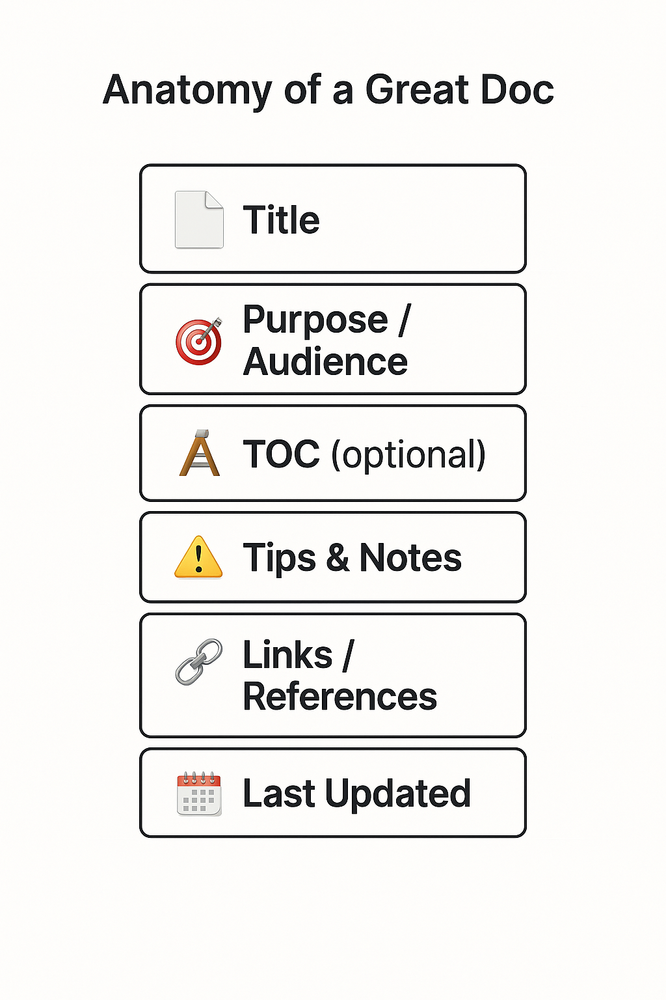

# USER GUIDE  
*How to Write Documentation Without Losing the Plot*

Welcome to the user guide for the **sans-serif-sentiments** project.  
This isn't your average documentation about documentation.  
This is a writer’s manual for writing manuals—without sounding like a manual.

---

## Who Is This For?

This guide is for:
- Writers who think “technical writing” is just a boring term for “corporate gray”
- Developers who document only when someone threatens their lunch break
- Contributors who want to write with clarity, consistency, and a tiny touch of soul

Whether you're creating a user manual, an API reference, or a how-to blog, this guide helps you write docs that **don’t just instruct—they resonate**.

---

## What You’ll Find Here

| Section | What It Covers |
|--------|----------------|
| [Before You Start](#2-before-you-start) | Tools, mindset, and the invisible prep work |
| [Anatomy of a Great Doc](#3-anatomy-of-a-great-doc) | Visual breakdown of documentation elements |
| [Writing Principles](#4-writing-principles) | How to write like a human, not a helpdesk |
| [Doc Types & Examples](#5-doc-types--examples) | Different doc styles and when to use them |
| [Visual Writing](#visual-writing) | Tables, UI cutouts, code blocks & delight |
| [Style in Action](./STYLE-GUIDE.md) | How to apply our style guide |
| [Remapped Examples](./examples/remapped-markdown.md) | Rewriting traditional docs in our voice |
| [FAQs](#faq--troubleshooting) | Because something will go wrong |
| [Next Steps](#next-steps) | Where to go from here |

---

## Why Another Writing Guide?

Because most guides:
- Assume you know what you’re doing
- Don’t explain *why* things are done that way
- Are as readable as your printer’s warranty

This one’s different.
It shows you how to:
- Write for when things **don’t** work (not just when they do)
- Consider how your doc will be read by a **developer**, a **designer**, or a **desperate team lead at 2:00 AM**
- Ask: “What’s the worst way this can be misunderstood?”—and then make it clearer

We respect your time, your sanity, and your tab limit.

---

## TL;DR

This is a minimalist yet detailed manual for writing helpful, honest, and human documentation.  
No buzzwords. No fluff. Just thoughtful writing for real people.

Let’s begin.
---

## 2. Before You Start 
🧭

> Good documentation isn’t just written—it’s prepared for.  
> This section helps you avoid rookie mistakes and shows you how to *think* like a technical writer before you even open a text editor.

---

### 🛠️ Tools You’ll Need

| Tool | Why You Need It |
|------|-----------------|
| A Markdown Editor (like VS Code, Typora, Obsidian) | To write in plain text and preview documentation |
| A Style Guide (like this one) | To ensure consistency in tone, format, and terminology |
| A Clear Requirements Brief | So you don’t write blindly—know what the doc needs to achieve |
| A Documentation Plan | Helps you scope the document, audience, and outcomes before you write |
| Your Brain (fully charged) | You’ll need empathy, clarity, and curiosity—no automation replaces that (yet) |

---

### 🧠 Mindset Before You Begin

- Don’t write to *impress*—write to **guide**
- Start with the reader’s **intent**, not your outline
- Avoid assuming the reader knows what you know
- Be kind to the next person who will read your doc at 2AM with tired eyes

---

### 🚫 Don’t Do This (A Little Table of Shame)

| Mistake | What It Looks Like | What to Do Instead |
|--------|---------------------|--------------------|
| ❌ Jumping straight into steps | `1. Click the button...` | ✅ Start with a purpose |
| ❌ Overloading jargon | `Configure with advanced tokenization` | ✅ Use plain English unless it’s truly needed |
| ❌ Ignoring different roles | Only SMEs will understand | ✅ Write modularly: “If you're a support agent, skip to section 3…” |
| ❌ Writing like you’re bored | “Just open the thing” | ✅ Write like you care (but don’t overdo it) |

---

### ✅ TL;DR

Before writing anything:
- Get your tools and thinking aligned
- Set your intention
- Remember: good documentation is a conversation, not a command

Up next: [Anatomy of a Great Doc →](#3-anatomy-of-a-great-doc)

---

## 3. Anatomy of a Great Doc

> You wouldn’t build a house without a blueprint. Don’t write documentation without one either.  
> This section is the blueprint. It shows you what every well-crafted document needs—no matter who it's for.

---

### 📊 The Skeleton: Standard Structure of a Useful Doc

| Section | Function |
|---------|----------|
| **📄 Title** | A short, searchable identifier—not a full sentence |
| **🎯 Purpose** | Why this document exists, and who it's meant for |
| **🧭 Scope or Audience** | Optional, but clarifies what roles it applies to (or doesn't) |
| **📚 Table of Contents** | Optional, but essential for longer docs |
| **🪜 Body** | The actual content: step-by-step, structured, scannable |
| **📷 Visual Aids** | Screenshots, tables, diagrams that reduce friction |
| **⚠️ Notes & Edge Cases** | Tips, warnings, things users might get wrong |
| **🔗 Related Links** | Point to supporting docs or source code |
| **📅 Last Updated** | Build trust. Readers want to know: *is this still valid?*

---

### 🧱 Visual Layout

Use this visual layout as a guide when building or reviewing your doc:

<div align="center">
  
</div>

---

### 🔍 Part-by-Part Breakdown with Examples

---

#### 🎯 Purpose

> *Start by telling the reader why this doc exists and who it's for.*

**❌ Common mistake:**
```markdown
# Setup Guide
1. Install the app…
```

✅ Fixed:
```markdown
# Setup Guide

This document helps new users install the app in under 5 minutes, with tips for Mac and Windows.

1. Install the app…
```

#### 🪜 Body

> *Organize your steps. Break them down. Don't assume your reader knows as much as you do.*

❌ Common mistake:

```markdown
Do the thing. Then do the other thing.
```

✅ Fixed:
```markdown
## Step 1: Download the Installer
Include platform-specific links here.

## Step 2: Run the File
Explain how to find it and what to expect.
#### ⚠️ Tips, Notes, and What Can Go Wrong

> *Readers want to avoid mistakes. This section is where you save them.*

```

❌ Common mistake:
```markdown
Skipping it entirely.
```

✅ Fixed:
```markdown
> ⚠️ **Troubleshooting Tip:** If installation fails on macOS Ventura, check System Preferences > Security and manually allow the app.
Use callout boxes, blockquotes, or bold labels to highlight issues and solutions.
```

#### 📅 Last Updated / Versioning

> *Trust comes from transparency. Help readers know how fresh your content is.*

❌ Common mistake:
```markdown
Leaving users to guess whether the doc is still relevant.
```

✅ Fixed:
```markdown
_Last updated: May 20, 2025_  
_Compatible with version 2.4.0 and above_
```

#### 🧨 When Can You Break the Format?

> *Great docs follow structure. Brilliant ones break it on purpose—with care.*

Break the format when:

Your doc is very short (e.g., CLI command reference)

You're creating onboarding slides or UI tooltips

The context is already crystal clear (e.g., error code guides)

But still try to signal structure—even in small ways.

---

### ✅ TL;DR

Good documentation has a predictable rhythm: it tells you where you're going, shows you how to get there, warns you of cliffs, and points to other maps if needed.

Structure is what makes your writing scale. It's not a crutch—it's a scaffold.

Up next: [Writing Principles →](#4-writing-principles)

---

## 4. Writing Principles  
*How to Write Like a Human, Not a Helpdesk*

> Most documentation tells users what to do. Great documentation helps them feel like they know what they’re doing.  
> This section teaches you how to stop sounding robotic and start writing like someone who cares if the reader finishes the sentence.

---

### 🎯 Intent Over Format

Before you start typing, ask:
- Why does this need to exist?
- Who will read this at 2AM?
- What’s the one thing they shouldn’t miss?

Every paragraph should **earn its place** by answering a question or reducing confusion.  
If it doesn’t, it’s decoration.

---

### ❌ Don’t Write Like This

**Common offenses we see in the wild:**

```markdown
Users should refer to the documentation to appropriately execute configuration steps for optimal output scenarios.
After installation, it is imperative to verify connectivity to ensure operational functionality.
```
> 🧱 *This is documentation as doorstop. Heavy, unreadable, and mostly ignored.*

### ✅ Do This Instead

Speak clearly. Write like you're in the same room—helpful, but not hand-holding.
```markdown
After you install the app, open it and check the top-right corner.  
If you see your name there, you're connected.
```
> ✨ Use short words. Use fewer words. Be obvious on purpose.

### 🧠 Writing Principles in Plain Words

| Principle                                  | What It Means                                           |
| ------------------------------------------ | ------------------------------------------------------- |
| 🎯 Write for the reader, not your reviewer | They don’t care how smart you are—they care if it works |
| ✂️ Cut what you just wrote in half         | Then cut again. If it still works, it’s better          |
| 🎢 Vary sentence rhythm                    | Mix short and long to avoid sounding like an alert log  |
| ❓ Anticipate user confusion                | Answer the question *before* they ask                   |
| 🧭 Signpost where they are                 | Especially in long docs—"Now that you’ve configured X…" |

### 🗂️ Quick Checklist: Before You Hit Publish

| Question                                  | Answered? |
| ----------------------------------------- | --------- |
| Is there a clear purpose at the top?      | ☐         |
| Have I defined who this is for?           | ☐         |
| Are steps broken into chunks?             | ☐         |
| Are examples included for context?        | ☐         |
| Did I remove any filler sentences?        | ☐         |
| Will a non-tech teammate understand this? | ☐         |
| Is this pleasant to skim?                 | ☐         |

> ✅ Pro tip: Read it out loud. If you cringe, fix it.

### 📌 TL;DR

Don’t just tell people what to do—help them feel like they can do it.

Write like you’re helping, not impressing.

If it sounds like a legal disclaimer, rewrite it. If it sounds like a Slack message, you're close.

Up next: [Doc Types & Examples →](#5-doc-types--examples)

---

---

## 5. Doc Types & Examples  
*Because not all docs wear the same shoes.*

> A setup guide should walk like a teacher,assuming you skipped the README..  
> An API reference should sit like a dictionary. Confident. Comprehensive. 
> A troubleshooting doc should already know you’re panicking.

Documentation is not a monolith—it’s a modular stack. This section shows you how to choose the right doc type for the right moment (and write it well).

---

### 🧭 Common Doc Types (and When to Use Them)

| Type | Purpose | When to Use |
|------|---------|-------------|
| **🛠️ Setup / Install Guide** | Help users get started without friction | First-time onboarding |
| **📘 How-To Guide** | Walk a user through a specific task or workflow | Task-focused learning |
| **📖 Reference Doc** | Describe every API, command, or setting | When users already know *what* they’re looking for |
| **🧪 Troubleshooting Guide** | Help users when something breaks | When errors occur or edge cases pop up |
| **🧠 Conceptual / Overview Doc** | Explain *why* something exists or matters | High-level understanding before doing |
| **🗂️ Release Notes / Changelog** | Summarize what changed and why | New versions, updates, feature flags |
| **🧾 Internal Process Doc** | Explain how contributors or teams should work | For your team, not end users |

---

### 🔍 Examples + Quick Templates

#### 🛠️ Setup Guide

> *"Just get me started."*

```markdown
## Getting Started

This guide helps new users install and run the app in under 5 minutes.

### 1. Download the Package  
Choose your OS and download the installer.

### 2. Run the Setup  
Double-click the file and follow the on-screen steps.

### 3. Verify the Installation  
Open the app. If you see the dashboard, you're good to go.
```

---

#### 📘 How-To Guide

> *"I need to do one thing, right now."*

```markdown
## How to Reset Your Password

This guide shows you how to reset your password using either email or 2FA.

1. Go to Settings > Account  
2. Click “Reset Password”  
3. Choose recovery method  
4. Follow the link or enter OTP  
```

---

#### 📖 Reference Doc

> *"I know what function I need, I just want the syntax."*

```markdown
### GET /users

Returns a list of all users.

**Query Parameters:**
- `limit`: Number of results to return
- `offset`: Where to start pagination

**Response:**
```json
{
  "users": [],
  "total": 10
}
```
```

---

#### 🧪 Troubleshooting Doc

> *"It’s not working. Help me."*

```markdown
## Can't Log In?

Here are 3 things to check:

### 1. Are your caps lock on?
Try retyping your password with it off.

### 2. Have you reset recently?
If so, try logging in from a private window.

### 3. Still stuck?
Contact support and include the following info:
- Screenshot of the error
- Browser and OS
```

---

### 🧠 What to Remember

- Different doc types solve different problems—don’t treat them the same
- Use Setup and How-To when guiding action  
- Use Reference and Conceptual when supporting exploration  
- Use Troubleshooting when saving someone from panic

---

### 📌 TL;DR

Not all documentation needs to explain everything.  
Sometimes, it just needs to say:  
**“Do this. Here’s how. You’re okay now.”**

Up next: [Visual Writing →](#6-visual-writing)

---

## 6. Visual Writing  
*Because your doc shouldn’t look like a wall of regret.*

> Docs should guide the eye as much as they guide the mind.  
> This section teaches you to structure your words so they’re easy to scan, follow, and act on—even when your user is tired, lost, or on their fourth coffee.

---

### 📐 Think in Blocks, Not Paragraphs

Use layout as your invisible UX designer.

| Element | Use It For |
|--------|-------------|
| **Headings** (`##`) | Break long docs into sections so people can find what they need |
| **Bullets / Lists** | Show process, options, or categories at a glance |
| **Tables** | Organize and compare structured information |
| **Callouts / Quotes** | Highlight tips, warnings, or context |
| **Code Blocks** | For commands, snippets, and terminal clarity |
| **Emojis or icons** | Add delight and help readers scan—sparingly and purposefully |

---

### 🧱 Example: Flat vs Structured

#### ❌ Don’t Do This

```markdown
To update your app, go to Settings. Scroll to “System”. Tap “Check for Updates”. If an update is available, tap “Download.” Wait for the process to finish. Your app will restart automatically.
```

#### ✅ Do This Instead

```markdown
## How to Update the App

1. Open **Settings**
2. Tap **System**
3. Select **Check for Updates**
4. If available, tap **Download**
5. Wait for it to finish
6. The app will restart automatically
```

> ✨ Format is meaning. Show, don’t just tell.

---

### 🎨 Make Tables Work Harder

Use tables for more than specs. Use them for clarity.

#### Instead of this:

```markdown
You can use this tool for file conversion, compression, encryption, and backup. It supports zip, tar, rar, and 7z formats.
```

#### Try this:

| Task        | Supported Formats |
|-------------|-------------------|
| Compression | `.zip`, `.tar`, `.rar`, `.7z` |
| Encryption  | `.zip`, `.7z` |
| Backup      | Any |
| Conversion  | `.zip` → `.tar`, `.7z` → `.zip` |

---

### 💬 UI Cutouts & Screenshots

> Sometimes, the fastest way to explain a UI is to literally show it.

- ✅ Use screenshots for confusing buttons or deep settings menus
- ✅ Add **circles**, **arrows**, or **callouts** to highlight what's important
- ✅ Crop images—don’t make your users hunt
- ✅ Add alt text: ``

> 🧠 Use images to reduce friction, not decorate the doc.

---

### 🖍️ Code Blocks That Don’t Burn Eyes

Use triple backticks for commands, JSON, code, or anything technical:

<small>Example: Shell command</small>

<pre>
```bash
npm install sans-serif-sentiments
```
</pre>

<small>Example: JSON response</small>

<pre>
```json
{
  "status": "ok",
  "version": "2.1.0"
}
```
</pre>

> ✅ Bonus tip: Label the language (`bash`, `json`, `html`) to enable syntax highlighting on GitHub.

---

### 📌 TL;DR

- Format is clarity
- Layout is empathy
- A doc that reads well is a doc that gets read

Up next: [Style in Action →](./STYLE-GUIDE.md)
